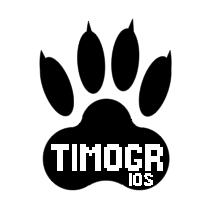

# TIMOGRiOS - TIny MObile GRaphics starter template for iOS



**TIMOGRiOS** is a tiny iOS starter template for creating fullscreen 2D apps using the
[TIGR](https://github.com/erkkah/tigr) library.

Like TIGR, TIMOGRiOS is designed to be small and mostly independent.
The "hello world" app bundle is less than 350k.

TIMOGRiOS takes away a lot of the hassle of working with iOS apps and makes
the complete development cycle super fast.

Oh, and you don't even have to open up Xcode to compile, debug and sign your apps!

## Prerequisites :shopping:

*To just run on a Simulator:*

* A Mac with Xcode installed

*To build apps for running on a device:*

* An Apple developer account
* [AppStoreConnect CLI](https://github.com/ittybittyapps/appstoreconnect-cli) installed and configured
    * Follow the instructions to create and install an AppStore Connect API Key
* The [ios deploy](https://github.com/ios-control/ios-deploy) tool installed

 Making image sets (see [Adding Resources](#Adding%20Resources) below) requires ImageMagick `convert` installed.

## Getting started :car:

* [Generate](https://github.com/erkkah/timogrios/generate) your own repo based on this template
* Clone your new repo to get the files to your machine

### A test run

Without any iDevice connected, run `./launch.sh`.

This should open a Simulator, build and launch the demo app.

If it launches, continue to the next step.

> *Don't worry if the app runs slowly in the Simulator.*

### Basics

**First**, you need to update the `Info.plist` file.
At least you should update `CFBundleIdentifier`, `CFBundleName` and `CFBundleDisplayName`.

> Pick a unique Bundle ID (`CFBundleIdentifier`) in reverse domain style,
like `com.example.myapp`, but obviously not exactly that.

**Now** you are all set to make another test build for the Simulator.

If you have any iDevice connected, disconnect it and run `./launch.sh`.

This should open a Simulator unless already running, build and launch the app with the configured display name.

> NOTE: TIGR uses OpenGL with some basic shaders, which will probably be software rendered on your simulator, making the app run slowly.
    *You will need to run on device to do any serious development work.*

### Run on device :iphone:

To be able to run on device, you need:

* a signing certificate for development
* a registered app identifier (bundle ID), and
* a development provisioning profile for your bundle ID.

You can set up all three on your [developer account](https://developer.apple.com/account) pages,
OR, you can **do it all from the comfort of your terminal**:

* Copy `settings.example` to `settings.env`
* Update the `APPSTORE_CONNECT_ISSUER_ID` and `APPSTORE_CONNECT_API_KEY_ID` settings in `settings.env`
    to provide access to the App Store API.
* Run `./makecert.sh development` to generate a signing certificate and import it
    into the keychain to make it available for code signing.
    * *If you already have a signing certificate, you don't need to create a new one!*
* Run `./registerid.sh` to register the bundle ID using the values from `Info.plist`.
* Run `./makeprofile.sh development` to create a development provisioning profile.

Make sure to update the `SIGNING_IDENTITY` and `PROVISIONING_PROFILE_ID` settings in `settings.env`.

Connect and unlock an iDevice and run `./launch.sh` again.

Now the app should run at full speed on your device.

### Start building :construction:

Replace the meat of `src/main.c` with your TIGR code, and you're done.

Just like with desktop TIGR, the code can be as tiny as this:

```C
#include "tigr.h"

void tigrMain()
{
    Tigr *screen = tigrWindow(320, 240, "Hello", TIGR_4X);
    while (!tigrClosed(screen))
    {
        tigrClear(screen, tigrRGB(0x80, 0x90, 0xa0));
        tigrPrint(screen, tfont, 120, 110, tigrRGB(0xff, 0xff, 0xff), "Hello, world.");
        tigrUpdate(screen);
    }
    tigrFree(screen);
}
```

## Adding resources

All files in the `resources` directory are included as is in the app bundle.
The `Icon` - files are icons in different sizes, and the `Launch` - files
are launch images.

Use the `makeImageSet.sh` script to create new icons or launch images.

For example:
```shell
$ cd resources
$ ../makeImageSet.sh screen Launch pink
```

The "color" argument can be specified in [any format accepted by ImageMagick](https://imagemagick.org/script/color.php).
You can specify an image file instead of the color, which makes sense for icons.

### Files and assets in TIGR

Reading files by using `tigrLoadImage` for example, reads from the corresponding bundle path. Putting `image.png` at `resources/images/image.png` will make it loadable from `/images/image.png`.

Writing files (`tigrSaveImage`) will write to the given system path. TIGR will not redirect writes to the app internal storage.

## Some details and pointers

### Input
* Since most iDevices are not used with physical keyboards, there is currently no keyboard support.
* The "buttons" reported by `tigrMouse` is the number of detected touch points, the position is always of the last triggered touch point.
* Use `tigrTouch` to process multi-touch input.

### Threads and extending the iOS side
The `tigrMain` entry point runs on a rendering thread separate from the main iOS thread.
If you need to do more iOS specifics, you can inherit from `TigrAppDelegate`.
Check out `main.m`.

### C/C++
You can of course replace main.c with main.cpp if you want. Just update the `Makefile` and declare `tigrMain` as `extern "C"`:

```C++
extern "C" void tigrMain() {
    // ...
}
```

## Debugging

TIMOGRiOS comes with a **complete debug setup** for VS Code with two configurations: "Debug on device" and "Debug in simulator".
Simply switch to the "run and debug" panel (⇧ ⌘ D), select the configuration and press "run" (▶ / F5).

You can also run `launch.sh debug` to launch the app in the LLDB commandline debugger.

> NOTE: On the simulator, the debugger breaks on launch and you need to "continue".

## Building for App Store / TestFlight

TBD
